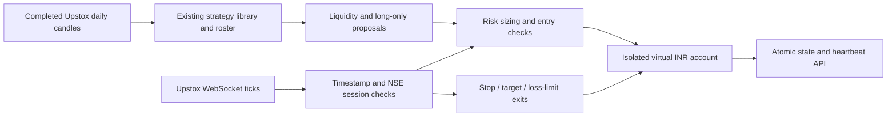

# Real-time paper trading and project review

Reviewed 2026-09-27. This is a paper research system, with no demonstrated robust
profit advantage. `HANDOFF.md` records unsuccessful timing strategies and weak
out-of-sample results; `data/strategy_roster.json` currently benches trend following,
breakout and candlestick strategies. More automation does not establish an edge.

## What the project already does

FastAPI and a Next.js dashboard expose a LangGraph market/news/reasoning/risk
pipeline. Yahoo and Upstox supply history; a JSON paper broker holds virtual INR;
SQLite journals research decisions; the backtester, strategy library and numpy
validator support research. GitHub Actions runs discrete scans. Some config entries
(broker routing, order types, infrastructure services) describe intentions rather
than implemented integrations.

The existing scan execution uses the market-analysis candle close, potentially from
a stale disk cache. Session checks alone do not make that a fresh executable price.
The journal's stop/target resolution is distinct from continuously managing actual
paper-broker positions. Treat the legacy account and journal as historical research.
The existing public static site is not a continuously running trading service.

## New runner

`python -m app.execution.realtime` defaults to Upstox **data** services using your existing account.
It has no real-order route and refuses any configured mode except `paper`.
No LLM, paid model, external database, cloud server, or funded trading balance is
needed for this runner. Your existing Upstox token and a running local computer are
needed; no FYERS account is required. Internet/electricity and any account-specific charges are outside the
software's zero API-subscription budget.



Signals use completed daily bars, refreshed once each open session. Live ticks drive
execution and exits; this is a daily-strategy runner with continuous execution,
not an intraday scalping strategy. It evaluates existing eligible library strategies,
requires their liquidity gate, and selects the strongest long proposal. Benched
strategies stay benched. No trade is a valid result.

Entries require an exchange timestamp at most 30 seconds old, fresh marks for every
held position, current-day signal, positive ordered levels, minimum reward/risk,
limited entry gap, confidence, whole shares, per-trade stop-risk budget, notional cap,
cash reserve, concurrency limits and the explicit restricted-symbol list. One entry
per symbol per day and minimum order spacing prevent repeated tick-driven buying.

Loss limits use marked equity, a persisted high-water mark, and the prior session's
last mark for overnight losses. A breach latches the account: fresh ticks close held
positions and no further entries are allowed, including after a restart. A holding
without fresh data cannot be safely flattened until its feed returns. Stop fills use
the observed tick plus adverse slippage, including gaps through the stop.

Protective levels, counters and fills persist together in `data/realtime_portfolio.json`.
An OS file lock prevents two CLI instances writing that account. Processing/persistence
errors stop the runner. The older `data/portfolio.json` account is separate.

## Setup and run (PowerShell)

1. Use the access token from your existing Upstox account. Set it locally in
   `.env`; never paste tokens into chat or commit them:

   ```dotenv
   UPSTOX_ACCESS_TOKEN=
   ```

2. Install the optional data socket SDK:

   ```powershell
   .venv/Scripts/python.exe -m pip install -r requirements-realtime.txt
   ```

3. Check configuration, then start the runner:

   ```powershell
   .venv/Scripts/python.exe -m app.execution.realtime --check
   .venv/Scripts/python.exe -m app.collectors.check_upstox
   .venv/Scripts/python.exe -m app.execution.realtime
   ```

   `--check` checks local credential presence only, not token validity. The runner
   prints a portfolio/feed heartbeat every five seconds. Renew expired tokens in
   `.env` and restart. It will wait outside regular NSE sessions. History failures
   block the affected symbol's entries for that session; restart after fixing them.

4. If FastAPI is running, `GET /paper/realtime` shows the independent account and
   heartbeat. `running` means a recent process heartbeat, **not** a healthy feed;
   inspect `fresh_symbols`, `unmarked_positions`, `event`, and `halt` too. The existing
   portfolio and trades APIs now report this same fill-based account. No live feed is published to
   the static GitHub Pages site.

## Publishing paper-account snapshots to GitHub Pages

Pages shows only actual continuous paper-account history. Research decisions and
their win rate remain separate; they never supply the equity curve. The chart
needs two daily marks, not two resolved trades.

On the machine running the account, export its latest complete persisted mark:

```powershell
.venv/Scripts/python.exe -m app.status.build_site
git add docs/data.json docs/nn.json docs/paper.json
git commit -m "Publish paper-account snapshot"
git push
```

`docs/paper.json` is the public reporting snapshot (portfolio, simulated trades,
positions and equity history); credentials and the private runner state are not
published. The export retains the account's original mark timestamp. Later cloud
research scans reuse this snapshot instead of wiping it when their checkout has
no local account. Publishing is explicit: starting the runner alone does not push
updates to GitHub. Run the export again to publish newer marks.

In repository **Settings → Pages → Build and deployment**, select **GitHub Actions**.
The `Deploy dashboard to GitHub Pages` workflow deploys `docs/` on pushes to
`master`, can be run manually, and is called directly after each published cloud
scan. Direct invocation is necessary because a bot's data commit does not trigger
another push workflow. No paper history can appear until the runner has recorded
marks and its snapshot has been published.

## Stopping entries and reviewing halts

Create `data/paper.stop` to block new entries while retaining protective exits:

```powershell
New-Item -ItemType File -Path data/paper.stop -Force
```

Remove that file to re-enable entry eligibility. Ctrl+C stops the process; no exits
are monitored while it is stopped. Risk halts do not reset automatically. After
review, a user can start a fresh experiment by stopping the runner and archiving
its account/status files; retain those records rather than erasing losses.

## Free market-data choices

These are current published provider claims, not a guarantee of future pricing or
unconditional access. Broker onboarding/KYC and authentication still apply.

| Provider | Published access | Fit |
| --- | --- | --- |
| Upstox | Existing account/token successfully authenticated for historical and WebSocket data | Default implemented adapter; no new broker account required |
| FYERS | Free historical data, quotes and market data; account/app required | Implemented WebSocket + historical adapter |
| Angel One SmartAPI | Free APIs including market feed and historical data | Alternative to evaluate; not implemented here |
| Shoonya | API access at no additional cost for eligible users; live and historical data | Alternative to evaluate; not implemented here |
| Dhan | Data API subscription ₹499 plus taxes/month | Does not meet zero-subscription requirement |
| Yahoo/yfinance | Existing unofficial history integration | Research fallback; not used for real-time fills |

Primary sources:

- [FYERS fees](https://support.fyers.in/portal/en/kb/articles/does-fyers-charge-any-subscription-fees-for-trading-api)
- [FYERS data permissions](https://support.fyers.in/portal/en/kb/articles/do-i-need-to-pay-for-datafeeds)
- [FYERS official WebSocket examples](https://github.com/FyersDev/fyers-skills/blob/master/skills/fyers-trading/references/websocket.md)
- [FYERS history schema](https://github.com/FyersDev/fyers-skills/blob/master/skills/fyers-trading/references/market-data.md)
- [FYERS authentication](https://github.com/FyersDev/fyers-skills/blob/master/skills/fyers-trading/references/auth.md)
- [Angel One SmartAPI](https://www.angelone.in/knowledge-center/smartapi/detailed-introduction-to-smartapi)
- [Shoonya APIs](https://shoonya.com/apis)
- [Dhan subscription](https://dhan.co/support/platforms/dhanhq-api/how-can-i-access-live-market-data-through-dhan/)

## Skills evaluated

Installed into the personal Codex skill directory (available automatically next turn):

- `ml4t-validate-data`: useful for timestamp, OHLCV, missing/duplicate and stale-data checks.
- `ml4t-kill-switch`: useful for deterministic loss limits and persistent trading halts.

Source: [ml4t/skills](https://github.com/ml4t/skills). These are coding guidance, not
runtime trading algorithms or proof of profitability. Reviewed the Markdown before
installing using the system skill installer. No ML4T Python packages were needed.
The repo's Ponytail guidance favors simple reuse and fits this change; OmniRoute
is unnecessary for a runner that makes no LLM calls. FYERS' official skill references
were useful API documentation; its broader real-order and strategy-optimization
workflow was not installed into this paper-only project.

## Limits and verification

Paper fills assume full execution at LTP plus configured slippage and flat commission.
They do not model order-book queueing, partial fills, full Indian taxes/fees, circuits,
settlement, or corporate-action adjustments to open holdings. Stops are software
checks, not exchange-resident orders. Sector/correlation constraints and an authoritative
live exchange-status gate are not implemented. The shared calendar falls back to
configured holidays if NSE is unavailable. Keep this a research experiment.

Tests exercise invalid/stale/future data, restart protection, duplicate prevention,
gap stops, loss-limit persistence, stale-position entry blocking, the entry stop file,
rollback on rejected orders, historical chunks and concurrent-runner locking.
SDK import and dependency consistency are checked locally. On 2026-09-27, your
existing Upstox token fetched 495 daily bars and connected to the WebSocket.
The closed-market snapshot was stale and rejected for fills. Market-session
fresh-tick/fill verification remains outstanding. No real orders were placed.

See [remediation.md](remediation.md) for accounting, backtest and model fixes.
